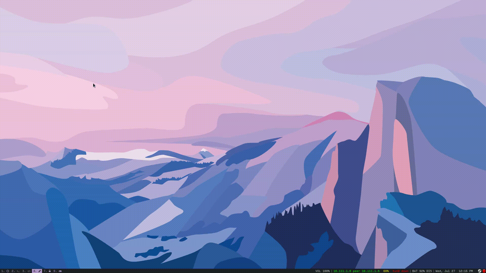

# dx/dt


**dx/dt is a simple python3 utility for opening and creating files**. It is inspired by Notational Velocity's simple, flat model of opening a page if it exists and creating one if it doesn't. dx/dt stays closer to the Unix philosophy-- it's simple and composable. It is a flexible tool, allowing for multiple notebooks, any kind of file, any editing program, and user templates. Most functionality is surfaced through a command line interface. Configuration is stored in plain text.

A rofi script is included for graphical usage, and as a reference for scripts using dx/dt.


## Usage Examples
Usage examples use the example configuration below. Use dxdt [subcommand] -h for more complete information.

```sh
$ dxdt open todo # Open a page at '~/Notes/todo.md' in a new gnome-terminal window, using vim, in the default book - 'notes'
$ dxdt open org jul06 # Open a page at '~/org/jul06.org' in emacs, in the book 'org'
```

```sh
$ dxdt get # get a list of all dx/dt books
notes
psych
org
$ dxdt get notes # get a list of all pages in book 'notes'
todo
groceries
cat name ideas
```

```sh
$ dxdt set -e emacs --template standard-note.md # Change some settings for 'notes'
$ dxdt set psyc -p ~/Documents/PSYC-200
```

```sh
$ dxdt bind .odf # Create a new book (name and path from current directory)
$ dxdt unbind # Unbind book in the current directory
$ dxdt bind .xcf --path ~/pics/working --book shops # create a new book, specifying settings
```


## Configuration

Books (and their pages) are the basic organizational model of dx/dt. Configuration is defined in **~/.dxdt/config** or through the **set** and **bind** subcommands.

### Example Configuration file:

```sh
# Set a default book and editor
[default]
editor = xdg-open
book = notes

[notes]
# Path and Extension must be defined for every notebook. Other settings are optional
# This notebook opens files in vim, in a new gnome-terminal window
path = ~/Notes
extension = .md
editor = gnome-terminal
arg1 = -e
arg2 = vim
# When opening a page, its path is appended to the final arg (in single quotes)

[psyc]
path = ~/Documents/PSYC-100
extension = .xoj
editor = xournal
# xournal, like many graphical programs, has issues with totally empty files.
# Using an empty .xoj file generated by the program prevents bugs.
# dx/dt looks for templates in ~/.dxdt/Templates/
template = blank.xoj

[org]
path = ~/org
extension = .org
editor = emacs
```
